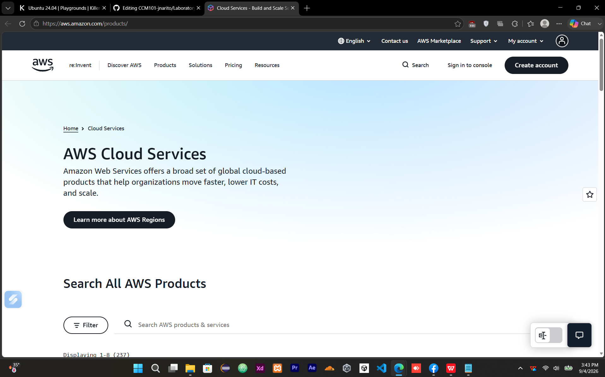

# ☁️ Amazon Web Services (AWS)

## Brief Overview

Amazon Web Services (AWS) is a cloud computing platform provided by Amazon that offers a broad collection of infrastructure and application services. AWS allows organizations to provision computing, storage, databases, networking, security, and other resources through cloud-based services instead of maintaining all physical infrastructure themselves. Its services can be accessed through the AWS Management Console, command-line tools, APIs, and other interfaces (Amazon Web Services, n.d.-a; Amazon Web Services, n.d.-b).

AWS supports a wide range of workloads, from basic web applications to large-scale enterprise systems. Its cloud services can be deployed across different geographic locations according to an organization's performance, availability, compliance, and data-residency requirements (Amazon Web Services, n.d.-c).

## Global Infrastructure

AWS organizes its global infrastructure into **Regions** and **Availability Zones**, with additional infrastructure such as Local Zones and Wavelength Zones. An AWS Region represents a separate geographic area, while Availability Zones are isolated locations within a Region. The Availability Zones within a Region are connected using low-latency, high-bandwidth networking to support highly available applications (Amazon Web Services, n.d.-c).

AWS currently provides Regions across North America, South America, Europe, Africa, Asia Pacific, and the Middle East. The number of Availability Zones differs between Regions. AWS recommends considering factors such as latency, available services, regulatory requirements, and geographic location when selecting a Region for a workload (Amazon Web Services, n.d.-c).

## Cloud Management Console

The **AWS Management Console** is a web-based interface that provides centralized access to AWS services. From the console, users can search for services, manage cloud resources, view notifications, access AWS CloudShell, manage account and billing information, and customize the console interface (Amazon Web Services, n.d.-b).

The AWS Management Console is useful for administrators and cloud users because many AWS resources can be created, configured, monitored, and managed through a graphical interface without requiring every operation to be performed from the command line.

## Four (4) Core Services

| Service        | Category                       | Description                                                                                                                                                                                                                                                                  |
| -------------- | ------------------------------ | ---------------------------------------------------------------------------------------------------------------------------------------------------------------------------------------------------------------------------------------------------------------------------- |
| **Amazon EC2** | Compute                        | Amazon Elastic Compute Cloud (EC2) provides scalable virtual computing capacity. Users can launch virtual servers, select instance types, configure networking and security, and adjust computing capacity according to workload requirements (Amazon Web Services, n.d.-d). |
| **Amazon S3**  | Object Storage                 | Amazon Simple Storage Service (S3) is an object storage service designed for storing and protecting data at large scale. It can support use cases such as websites, applications, backup and restore, archives, data lakes, and analytics (Amazon Web Services, n.d.-e).     |
| **Amazon RDS** | Relational Database            | Amazon Relational Database Service (RDS) is a managed relational database service that simplifies database deployment, operation, scaling, backups, patching, and recovery (Amazon Web Services, n.d.-f).                                                                    |
| **AWS IAM**    | Identity and Access Management | AWS Identity and Access Management (IAM) controls authentication and authorization for AWS resources. It allows administrators to define identities, roles, and permissions that determine what users and applications can access (Amazon Web Services, n.d.-g).             |

## Three (3) Advantages

### 1. Scalable Computing

AWS provides scalable computing resources through services such as Amazon EC2. Organizations can increase or decrease computing capacity according to workload requirements instead of maintaining a fixed amount of physical hardware (Amazon Web Services, n.d.-d).

### 2. Broad Service Availability

AWS provides a large collection of cloud services covering computing, storage, databases, identity, networking, analytics, and other technology requirements. These services can be combined to build different types of cloud architectures (Amazon Web Services, n.d.-a).

### 3. Global Deployment Options

AWS provides geographically distributed Regions and Availability Zones. This allows organizations to select locations based on factors such as application latency, availability, regulatory requirements, and customer location (Amazon Web Services, n.d.-c).

## Typical Enterprise Use Cases

AWS can be used by enterprises for a variety of workloads, including:

* **Web and application hosting** using Amazon EC2 and related services.
* **Enterprise data storage and backup** using Amazon S3.
* **Relational database workloads** using Amazon RDS.
* **Scalable business applications** that need computing capacity to change according to demand.
* **Identity and access management** using AWS IAM.
* **Disaster recovery and highly available architectures** by distributing workloads across Availability Zones or Regions.

These use cases demonstrate how AWS services can be combined to provide computing, storage, database, and access-management capabilities for enterprise environments (Amazon Web Services, n.d.-c; Amazon Web Services, n.d.-d; Amazon Web Services, n.d.-e; Amazon Web Services, n.d.-f; Amazon Web Services, n.d.-g).

## Screenshot

The laboratory activity requires at least one screenshot of the official AWS homepage or management console.



**Screenshot filename:**

```text
aws-homepage.png
```

**Location:**

```text
Laboratory-03-Multi-Cloud-Explorer/screenshots/aws-homepage.png
```

## References

Amazon Web Services. (n.d.-a). *AWS cloud products*. https://aws.amazon.com/products/

Amazon Web Services. (n.d.-b). *What is the AWS Management Console?* AWS Management Console documentation. https://docs.aws.amazon.com/awsconsolehelpdocs/latest/gsg/what-is.html

Amazon Web Services. (n.d.-c). *AWS Regions and Availability Zones*. AWS Global Infrastructure documentation. https://docs.aws.amazon.com/global-infrastructure/latest/regions/aws-regions-availability-zones.html

Amazon Web Services. (n.d.-d). *What is Amazon EC2?* Amazon EC2 documentation. https://docs.aws.amazon.com/AWSEC2/latest/UserGuide/concepts.html

Amazon Web Services. (n.d.-e). *What is Amazon S3?* Amazon S3 documentation. https://docs.aws.amazon.com/AmazonS3/latest/userguide/Welcome.html

Amazon Web Services. (n.d.-f). *What is Amazon Relational Database Service (Amazon RDS)?* Amazon RDS documentation. https://docs.aws.amazon.com/AmazonRDS/latest/UserGuide/Welcome.html

Amazon Web Services. (n.d.-g). *What is IAM?* AWS Identity and Access Management documentation. https://docs.aws.amazon.com/IAM/latest/UserGuide/introduction.html
