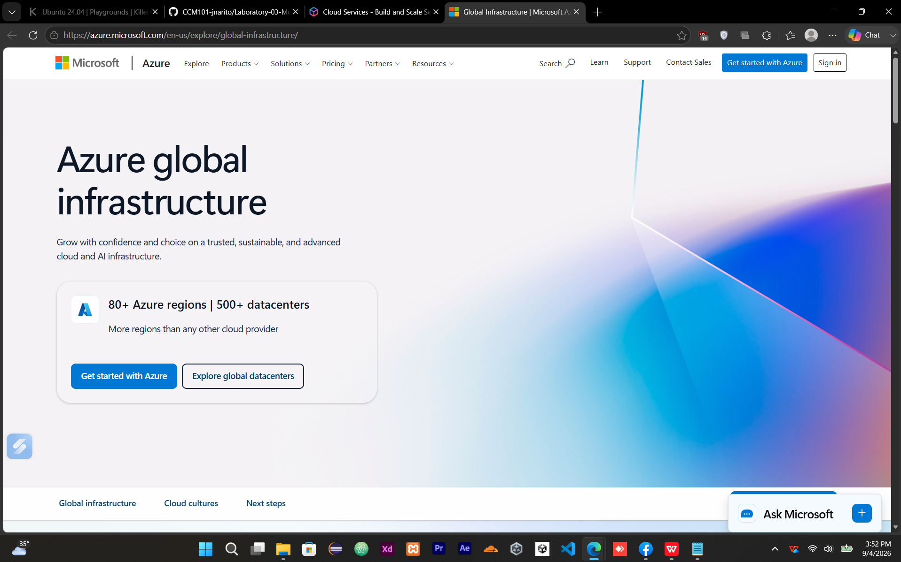

# Microsoft Azure

## Brief Overview

Microsoft Azure is Microsoft's cloud computing platform that provides cloud services for computing, storage, databases, networking, identity, analytics, and application development. Organizations can use Azure to create, manage, and monitor applications and infrastructure through the Azure portal and other management tools (Microsoft, 2026a; Microsoft, 2026b).

Azure supports both Microsoft and non-Microsoft workloads, including Windows and Linux virtual machines. Its services can be used for application development, enterprise infrastructure, data management, identity management, and hybrid cloud scenarios (Microsoft, 2025a).

## Global Infrastructure

Azure provides a geographically distributed cloud infrastructure organized into **regions**, datacenters, and other infrastructure locations. Microsoft's current Azure global infrastructure information lists **80+ Azure regions and 500+ datacenters**, providing organizations with options for deploying workloads closer to users and meeting data-residency requirements (Microsoft, n.d.).

Azure regions allow organizations to select locations according to requirements such as latency, availability, compliance, and data residency. The geographic distribution of Azure infrastructure also supports organizations that need to deploy applications across multiple locations.

## Cloud Management Console

The **Azure portal** is a web-based unified console for creating, managing, and monitoring Azure resources. Through the portal, users can manage subscriptions and cloud resources through a graphical interface, including virtual machines, databases, applications, and other Azure services (Microsoft, 2026b).

The portal also provides dashboards, search functionality, resource management features, and monitoring capabilities. Users can manage both simple cloud applications and more complex cloud deployments through the same web-based interface.

## Four (4) Core Services

| Service                    | Category                       | Description                                                                                                                                                                                                                  |
| -------------------------- | ------------------------------ | ---------------------------------------------------------------------------------------------------------------------------------------------------------------------------------------------------------------------------- |
| **Azure Virtual Machines** | Compute                        | Azure Virtual Machines provide on-demand and scalable computing resources. They support both Windows and Linux workloads and provide users with significant control over the virtual machine environment (Microsoft, 2025a). |
| **Azure Blob Storage**     | Object Storage                 | Azure Blob Storage is Microsoft's object storage service for storing large amounts of unstructured data such as text and binary files (Microsoft, 2026c).                                                                    |
| **Azure SQL Database**     | Relational Database            | Azure SQL Database is a fully managed platform-as-a-service relational database. Microsoft manages tasks such as patching, backups, monitoring, and other infrastructure-level database operations (Microsoft, 2026d).       |
| **Microsoft Entra ID**     | Identity and Access Management | Microsoft Entra ID is a cloud-based identity and access management service that provides authentication, access control, and protection for users, devices, applications, and resources (Microsoft, 2026e).                  |

## Three (3) Advantages

### 1. Strong Enterprise and Microsoft Integration

Azure provides services designed for Microsoft-based environments, including Windows workloads and Microsoft identity technologies. Microsoft Entra ID can also be used to manage identities and access to cloud resources and applications (Microsoft, 2026e).

### 2. Broad Global Infrastructure

Azure's geographically distributed infrastructure provides organizations with many regions and datacenters from which to deploy workloads. This can help organizations address latency, data residency, and geographic deployment requirements (Microsoft, n.d.).

### 3. Managed Cloud Services

Azure includes managed services such as Azure SQL Database, where Microsoft handles many database administration tasks including patching, backups, monitoring, and maintenance. This allows organizations to focus more on applications and data rather than managing the underlying infrastructure (Microsoft, 2026d).

## Typical Enterprise Use Cases

Microsoft Azure can be used by enterprises for:

* **Windows Server and application hosting** using Azure Virtual Machines.
* **Linux application hosting** using Azure Virtual Machines.
* **Enterprise file and object storage** using Azure Blob Storage.
* **Relational database applications** using Azure SQL Database.
* **Identity and access management** using Microsoft Entra ID.
* **Hybrid and Microsoft-centered enterprise environments** that require integration with Microsoft's cloud and identity ecosystem.

These use cases demonstrate how Azure can support enterprise infrastructure, application hosting, storage, databases, and identity management (Microsoft, 2025a; Microsoft, 2026c; Microsoft, 2026d; Microsoft, 2026e).

## Screenshot

The laboratory activity requires at least one screenshot of the official Azure homepage or management console.



**Screenshot filename:**

```text
azure-homepage.png
```

**Location:**

```text
Laboratory-03-Multi-Cloud-Explorer/screenshots/azure-homepage.png
```

## References

Microsoft. (n.d.). *Azure global infrastructure*. Microsoft Azure. https://azure.microsoft.com/en-us/explore/global-infrastructure/

Microsoft. (2025a). *Overview of virtual machines in Azure*. Microsoft Learn. https://learn.microsoft.com/en-us/azure/virtual-machines/overview

Microsoft. (2026a). *Introduction to Azure Storage*. Microsoft Learn. https://learn.microsoft.com/en-us/azure/storage/common/storage-introduction

Microsoft. (2026b). *What is the Azure portal?* Microsoft Learn. https://learn.microsoft.com/en-us/azure/azure-portal/azure-portal-overview

Microsoft. (2026c). *Introduction to Blob (object) Storage*. Microsoft Learn. https://learn.microsoft.com/en-us/azure/storage/blobs/storage-blobs-introduction

Microsoft. (2026d). *What is the Azure SQL Database service?* Microsoft Learn. https://learn.microsoft.com/en-us/azure/azure-sql/database/sql-database-paas-overview

Microsoft. (2026e). *What is Microsoft Entra?* Microsoft Learn. https://learn.microsoft.com/en-us/entra/fundamentals/what-is-entra
