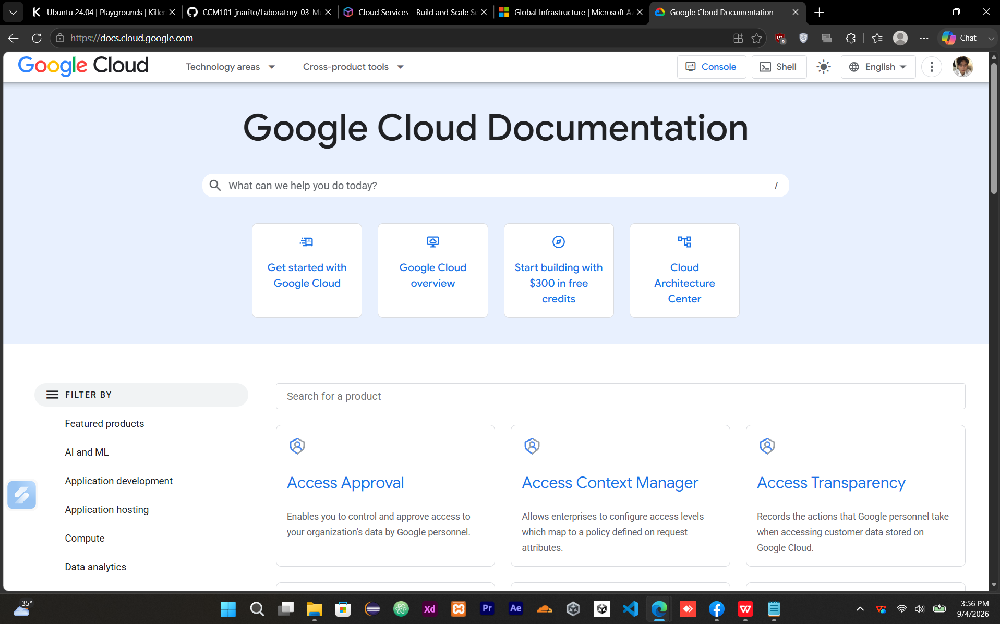

# 🟢 Google Cloud Platform (GCP)

## Brief Overview

Google Cloud Platform (GCP), commonly referred to as Google Cloud, is Google's cloud computing platform. It provides cloud services that organizations can use to build, deploy, manage, and scale applications and infrastructure. Google Cloud organizes its capabilities into services that cover areas such as computing, storage, databases, networking, identity, analytics, and application development (Google Cloud, 2026a).

Google Cloud resources are organized within projects, which provide an organizational boundary for resources, permissions, and billing. Users can interact with Google Cloud through the Google Cloud console, Google Cloud CLI, client libraries, and APIs (Google Cloud, 2026a).

## Global Infrastructure

Google Cloud's infrastructure is organized into **regions and zones**. Regions represent geographic locations where Google Cloud resources can be deployed, while zones provide separate deployment locations within regions. Distributing workloads across zones and regions can help organizations design systems with greater failure independence and availability (Google Cloud, 2026b).

As of August 2026, Google Cloud's official global locations page lists **43 regions and 130 zones** across six continents. Google Cloud also operates a global network connecting more than 200 countries through its network infrastructure (Google Cloud, 2026c).

## Cloud Management Console

The **Google Cloud console** is a web-based graphical interface for managing Google Cloud projects and resources. It provides access to projects, resource management, billing information, activity information, and Google Cloud Shell (Google Cloud, 2026d).

Users can use the console to create and manage services such as Compute Engine virtual machines, storage resources, databases, networking resources, and identity permissions. The console provides a graphical alternative to using command-line tools and APIs.

## Four (4) Core Services

| Service            | Category                       | Description                                                                                                                                                                                                                                                               |
| ------------------ | ------------------------------ | ------------------------------------------------------------------------------------------------------------------------------------------------------------------------------------------------------------------------------------------------------------------------- |
| **Compute Engine** | Compute                        | Compute Engine is an Infrastructure-as-a-Service product that provides virtual machines and bare metal instances on Google infrastructure. Users can configure computing resources according to their workload requirements (Google Cloud, 2026e).                        |
| **Cloud Storage**  | Object Storage                 | Cloud Storage is a scalable and managed object storage service. Data is stored as objects inside buckets, and access permissions can be configured for stored data (Google Cloud, 2026f).                                                                                 |
| **Cloud SQL**      | Relational Database            | Cloud SQL is a fully managed relational database service supporting MySQL, PostgreSQL, and SQL Server. It handles common administration tasks such as backups, maintenance, updates, monitoring, and high availability features (Google Cloud, 2026g).                    |
| **Cloud IAM**      | Identity and Access Management | Google Cloud Identity and Access Management (IAM) allows organizations to manage permissions for Google Cloud resources. It provides a consistent access-control system for controlling who can access resources and what actions they can perform (Google Cloud, 2026h). |

## Three (3) Advantages

### 1. Global Infrastructure

Google Cloud provides a geographically distributed infrastructure of regions and zones. Organizations can choose deployment locations based on requirements such as latency, availability, and data residency (Google Cloud, 2026b; Google Cloud, 2026c).

### 2. Scalable Computing

Compute Engine provides configurable virtual machines and bare metal instances that can be scaled according to workload requirements. Google Cloud supports different machine families for general-purpose, compute-optimized, memory-optimized, storage-optimized, and accelerator-oriented workloads (Google Cloud, 2026e).

### 3. Managed Services

Google Cloud provides managed services such as Cloud SQL and Cloud Storage. Cloud SQL, for example, handles many database administration operations including backups, maintenance, updates, monitoring, and high availability features (Google Cloud, 2026g).

## Typical Enterprise Use Cases

Google Cloud can be used by enterprises for:

* **Virtual machine hosting** using Compute Engine.
* **Object storage and data management** using Cloud Storage.
* **Relational database applications** using Cloud SQL.
* **Identity and permission management** using Cloud IAM.
* **Globally distributed applications** that require deployment across multiple regions and zones.
* **Scalable enterprise workloads** that require configurable computing resources.

These use cases demonstrate how Google Cloud can provide computing, storage, database, identity, and global infrastructure capabilities for enterprise applications (Google Cloud, 2026c; Google Cloud, 2026e; Google Cloud, 2026f; Google Cloud, 2026g; Google Cloud, 2026h).

## Screenshot

The laboratory activity requires at least one screenshot of the official Google Cloud homepage or management console.



**Screenshot filename:**

```text
gcp-homepage.png
```

**Location:**

```text
Laboratory-03-Multi-Cloud-Explorer/screenshots/gcp-homepage.png
```

## References

Google Cloud. (2026a). *Google Cloud overview*. Google Cloud Documentation. https://docs.cloud.google.com/docs/overview

Google Cloud. (2026b). *Global, regional, and zonal resources*. Google Cloud Documentation. https://docs.cloud.google.com/compute/docs/regions-zones/global-regional-zonal-resources

Google Cloud. (2026c). *Global locations: Regions & zones*. Google Cloud. https://cloud.google.com/about/locations

Google Cloud. (2026d). *Google Cloud console*. Google Cloud. https://cloud.google.com/cloud-console

Google Cloud. (2026e). *Compute Engine overview*. Google Cloud Documentation. https://docs.cloud.google.com/compute/docs/overview

Google Cloud. (2026f). *Cloud Storage overview*. Google Cloud Documentation. https://docs.cloud.google.com/storage/docs/introduction

Google Cloud. (2026g). *Cloud SQL overview*. Google Cloud Documentation. https://docs.cloud.google.com/sql/docs/introduction

Google Cloud. (2026h). *Identity and Access Management documentation*. Google Cloud Documentation. https://docs.cloud.google.com/iam/docs
